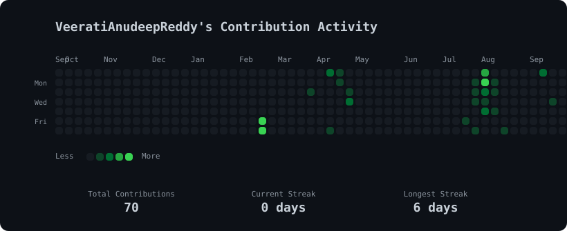

`anudeep@github:~$ whoami`

<table>
  <tr>
    <td valign="top">
      
    </td>
    <td valign="top">
      
    </td>
  </tr>
</table>

 

`anudeep@github:~$ ./contributions.sh`

 

## 👋 About Me

**Anudeep Reddy Veerati**

Computer Science Undergraduate at VNR VJIET

CGPA: **9.35**

Passionate about

• AI  
• Full Stack Development  
• Competitive Programming  
• System Design

Achievements

⭐ CodeChef 2★  
🏆 Webathon Winner

 

## 🚀 Featured Projects

| Project | Description | Tech Stack |
| --- | --- | --- |
| **Civix** | Civic issue reporting and resolution platform | React, Node.js, MongoDB |
| **StudyAI** | AI-powered study planner and assistant | Next.js, Python, OpenAI |
| **Pothole Mapper** | Road defect detection and mapping system | Flutter, YOLO, Firebase |
| **VoIP Caller** | Voice-over-IP calling application | Dart, WebRTC, Node.js |

 

## 🛠 Tech Stack

**Languages**

**Frontend**

**Backend**

**Databases**

**AI**

 

## 📫 Connect

